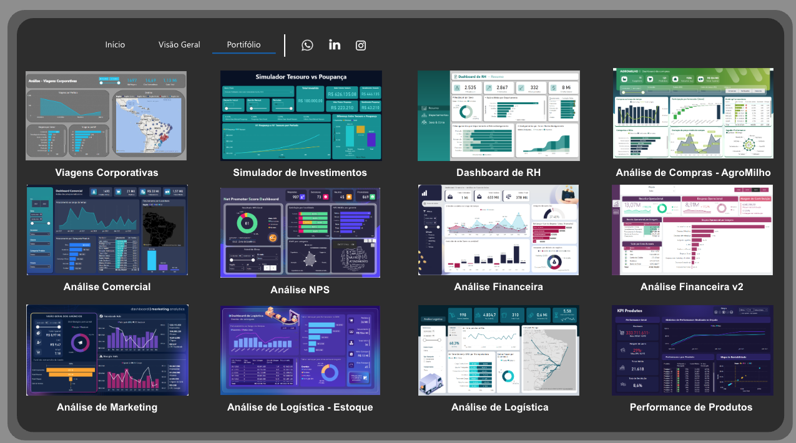
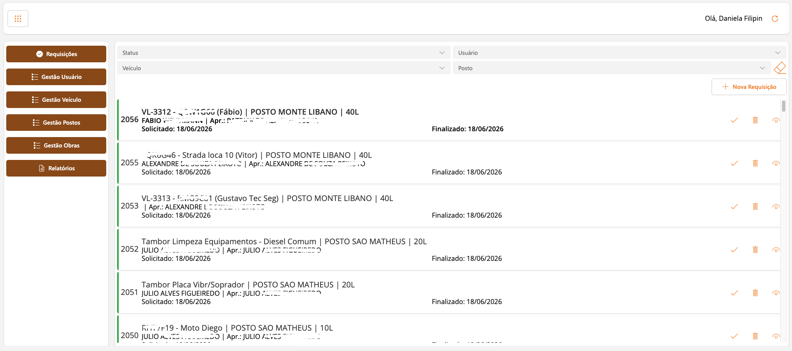
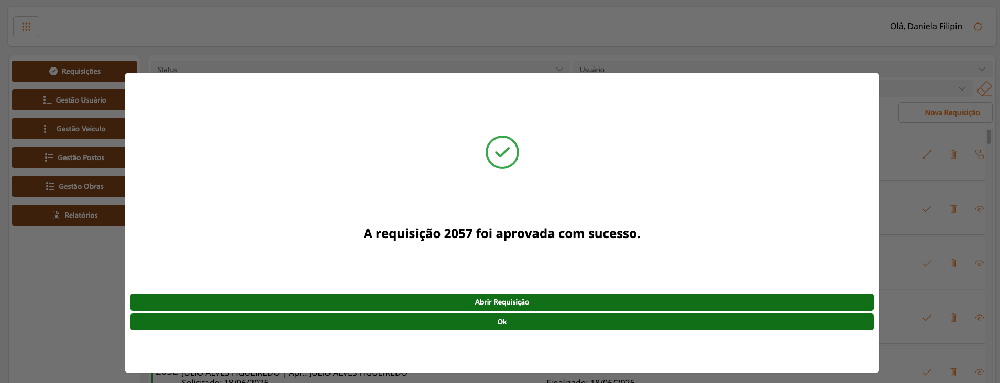
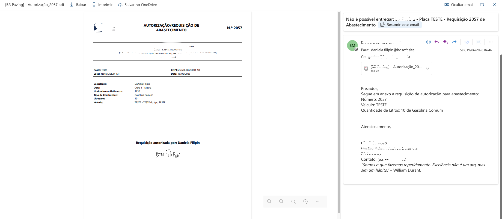

# Portfólio Técnico — Daniela Filipin

Sou graduada em Engenharia de Computação e mestranda em Ciência de Dados, com experiência no desenvolvimento de soluções digitais, automação de processos, análise de dados, dashboards e aplicações com Power Platform.

Atuo com foco em transformar processos manuais em soluções mais eficientes, organizadas e orientadas por dados, utilizando tecnologias como Python, Power BI, Power Apps, Power Automate, SharePoint, modelagem de dados e integração de sistemas.

---

## Áreas de atuação

- Desenvolvimento de soluções internas
- Automação de processos
- Business Intelligence e dashboards
- Modelagem e tratamento de dados
- Integração entre sistemas, planilhas, APIs e bancos de dados
- Aplicações com Power Apps e fluxos com Power Automate
- Projetos em Python para análise, automação e ciência de dados

---

## Projetos em destaque

| Projeto | Tipo | Tecnologias | Link |
|---|---|---|---|
| Automação de Relatórios Operacionais | Automação em Python | Python, pandas, automação web, logs, variáveis de ambiente | [Ver repositório](https://github.com/devfilipin/automacao-python) |
| Predição de Customer Churn | Machine Learning / Ciência de Dados | Python, pandas, scikit-learn, imbalanced-learn, XGBoost, LightGBM, CatBoost, SHAP | [Ver repositório](https://github.com/devfilipin/pipelines_ml_churn) |
| Dashboards e Business Intelligence | Power BI | Power BI, Power Query, DAX, KPIs, modelagem de dados | [Ver portfólio visual](https://app.powerbi.com/view?r=eyJrIjoiNDMyZTQ5Y2QtYzA4MC00OWFjLTllNzctMmNjZTdiMTkyOGM2IiwidCI6IjYxZDIzNTMwLWJhNzItNDA3ZS05NGU4LTYwY2JhNjYxNjdiOSJ9) |
| App de Solicitação de Combustível | Power Platform | Power Apps, Power Automate, SharePoint, Outlook | [Ver case](#app-de-solicitação-de-combustível) |

---

# Cases técnicos

## Automação de Relatórios Operacionais

Automação desenvolvida em Python para execução de rotinas operacionais relacionadas à geração, download, processamento e organização de relatórios.

A solução foi estruturada com scripts modulares, orquestrador principal, configuração por variáveis de ambiente, geração de logs, tratamento de erros e organização dos arquivos processados.

### Funcionalidades

- Execução automatizada de rotinas
- Organização de fluxos por tipo de relatório
- Configuração por variáveis de ambiente
- Registro de logs de execução
- Tratamento de erros
- Processamento e organização de arquivos
- Envio opcional de notificações por e-mail

### Tecnologias utilizadas

- Python
- pandas
- automação web
- pathlib / os
- smtplib
- variáveis de ambiente
- logs e tratamento de exceções

### Link

[Repositório da automação em Python](https://github.com/devfilipin/automacao-python)

---

## Predição de Customer Churn

Projeto de ciência de dados desenvolvido para prever customer churn no setor de telecomunicações, utilizando o Telco Customer Churn Dataset.

O projeto contempla consolidação de bases, preparação dos dados, divisão treino/teste, pré-processamento, treinamento de modelos supervisionados, avaliação de estratégias de balanceamento, otimização de hiperparâmetros e interpretação dos atributos mais relevantes.

### Funcionalidades

- Consolidação e preparação dos dados
- Divisão em treino e teste
- Pré-processamento de variáveis numéricas e categóricas
- Treinamento de modelos baseline
- Avaliação de estratégias de balanceamento
- Otimização de modelos
- Avaliação final em conjunto de teste
- Análise de importância dos atributos

### Tecnologias utilizadas

- Python
- pandas
- scikit-learn
- imbalanced-learn
- XGBoost
- LightGBM
- CatBoost
- SHAP
- matplotlib
- joblib

### Link

[Repositório do projeto de churn](https://github.com/devfilipin/pipelines_ml_churn)

---

## Dashboards e Business Intelligence

Dashboards desenvolvidos para análise de indicadores comerciais, financeiros, logísticos, de RH, marketing e compras.

Os projetos envolvem tratamento e modelagem de dados, criação de medidas, organização visual dos indicadores e construção de painéis voltados para apoio à tomada de decisão.

### Áreas contempladas

- Comercial
- Financeiro
- Recursos Humanos
- Logística
- Marketing
- Compras
- Produtos
- Viagens corporativas
- Simulação de investimentos

### Tecnologias utilizadas

- Power BI
- Power Query
- DAX
- Modelagem de dados
- KPIs
- Visualização de dados

### Exemplos visuais

  

### Link

[Portfólio visual de dashboards](https://app.powerbi.com/view?r=eyJrIjoiNDMyZTQ5Y2QtYzA4MC00OWFjLTllNzctMmNjZTdiMTkyOGM2IiwidCI6IjYxZDIzNTMwLWJhNzItNDA3ZS05NGU4LTYwY2JhNjYxNjdiOSJ9)

---

## App de Solicitação de Combustível

Aplicação desenvolvida para controlar o processo de solicitação de combustível, permitindo o acompanhamento do fluxo desde a abertura do pedido até a finalização com a nota fiscal.

O app foi desenvolvido para apoiar motoristas, aprovadores e postos de combustível, centralizando o processo e reduzindo a troca manual de informações.

### Fluxo do processo

1. O motorista realiza a solicitação de combustível pelo aplicativo.
2. O aprovador analisa a solicitação.
3. Caso aprove, a requisição é enviada automaticamente ao posto de combustível por e-mail.
4. Caso recuse, o motorista é notificado por e-mail.
5. Após o abastecimento, o posto responde o e-mail com a nota fiscal.
6. A solicitação é finalizada com o registro do número da nota fiscal.

### Funcionalidades

- Cadastro de solicitação pelo motorista
- Controle de status da solicitação
- Aprovação ou recusa por responsável
- Envio automático de e-mail ao posto de combustível
- Notificação automática ao motorista
- Registro da nota fiscal
- Finalização da solicitação

### Tecnologias utilizadas

- Power Apps
- Power Automate
- SharePoint
- Outlook
- Regras de negócio e controle de status

### Minha atuação

Atuei na modelagem do processo, desenvolvimento da aplicação, criação das regras de negócio, estruturação das listas de dados, configuração dos fluxos de aprovação e automação dos envios e notificações por e-mail.

### Imagens do projeto

  

  

  

---

## Outros projetos e experiências

Além dos projetos destacados, também desenvolvi soluções envolvendo:

- Aplicações internas com Power Apps
- Fluxos de aprovação com Power Automate
- Relatórios e dashboards no Power BI
- Integração entre planilhas, listas SharePoint, APIs e bancos de dados
- Automatização de rotinas administrativas e operacionais
- Modelagem de dados para acompanhamento de indicadores

---

## Confidencialidade

Alguns projetos foram desenvolvidos em contexto corporativo. Por esse motivo, dados reais, nomes de empresas, usuários, e-mails, caminhos internos, credenciais, arquivos gerados e regras específicas de negócio foram removidos, substituídos ou anonimizados.

Os materiais apresentados neste portfólio têm finalidade demonstrativa e técnica.

---

## Contato

- GitHub: [github.com/devfilipin](https://github.com/devfilipin)
- LinkedIn: https://www.linkedin.com/in/daniela-filipin/
